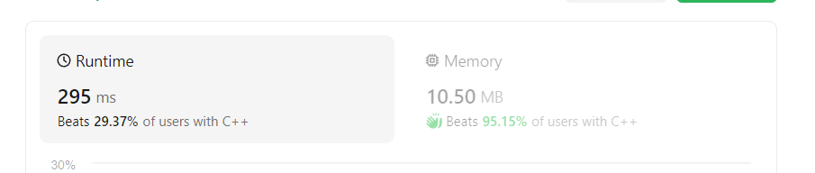
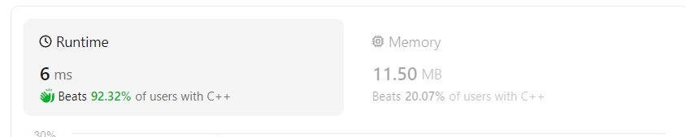

# The problem

## 1. Two Sum
Given an array of integers `nums` and an integer `target`, return _indices of the two numbers such that they add up to `target`_.

You may assume that each input would have **_exactly_ one solution**, and you may not use the _same_ element twice.

You can return the answer in any order.

**Example 1:**

>**Input:** nums = [2,7,11,15], target = 9
>
>**Output:** [0,1]
>
>**Explanation:** Because nums[0] + nums[1] == 9, we return [0, 1].

**Example 2:**

>**Input:** nums = [3,2,4], target = 6
>
>**Output:** [1,2]

**Example 3:**

>**Input:** nums = [3,3], target = 6
>
>**Output:** [0,1]

Constraints:

* 2 <= nums.length <= 104
* -109 <= nums[i] <= 109
* -109 <= target <= 109
* **Only one valid answer exists**.

# Solution

## [Memory effective](memoryeffective.cpp)

The easiest solution is to start with an index and then compare all next elements with the target. In this situation u almost don't use any memory, but you iterate approximately n * n -1 , which is O(n2). Here are the results of effectivity.

## [Time effective](timeeffective.cpp)

Well, if you need a faster algorithm, you can use some memory to store some data. In this variation we go 1 time through the vector, so our time complexity will be O(n).

